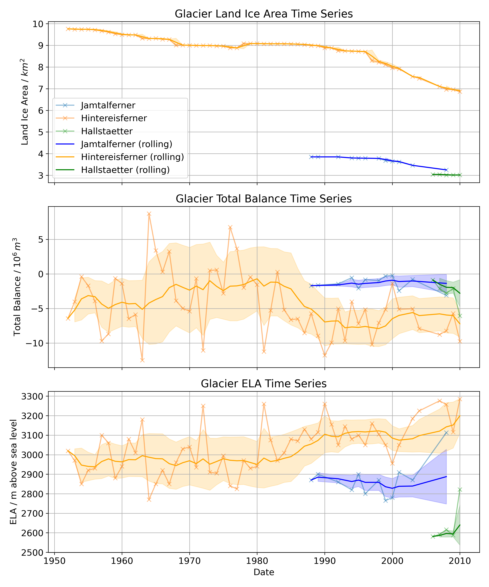

# Glacier Analysis

Data analysis of long-term glacier retreat in Austria, written up as a policy paper for the Quantitative Environmental Science course (Part IB Natural Sciences, Cambridge), connecting glacial melt to the economics of Austrian ski tourism.

## Project

Three glaciers — **Hallstätter**, **Hintereisferner**, and **Jamtalferner** — sit near major Austrian ski resorts and have long historical monitoring records of land ice area and equilibrium line altitude (ELA, the elevation above which a glacier gains more mass than it loses). The project uses these records to quantify retreat trends, then connects the finding to tourism GDP data to motivate the policy question of how glacial melt affects the ski industry.

## Analysis

- **Per-glacier cleaning and elevation analysis** (`Hallstaetter_analysis.ipynb`, `Hintereisferner_analysis.ipynb`, `Jamtalferner_analysis.ipynb`): parsing historical area-by-elevation-band records into a consistent time series per glacier and visualising how the ice area at each elevation band has shifted over the monitoring period.
- **Cross-glacier trend analysis** (`rolling_window.ipynb`): combining all three glaciers' land ice area records and applying a 2-year (730-day) rolling mean to separate the shared long-term decline from noisy year-to-year measurement variation.
- **Geographic context** (`Map_projection.ipynb`): a Cartopy-based map placing the three glaciers relative to major nearby ski resorts, motivating the tourism-economics framing of the policy paper.
- `preliminary_analysis.ipynb` is left as-is from an early correlation-discovery pass and is intentionally not cleaned up — it's the exploratory work that preceded the analysis above, not a finished result.

## Results

**Ice area has retreated toward higher elevations at all three glaciers** — each elevation-band time series (example below, Hintereisferner) shows the lower-elevation area shrinking over the record while the glacier's mass concentrates at higher, colder elevations:

**The rolling-window analysis confirms this is a shared, sustained trend rather than noise** — smoothing out annual variability shows a consistent downward trajectory in land ice area across all three glaciers over the monitoring period:

The full write-up, including the tourism-economic argument, is in `Policy Paper.pdf`.
