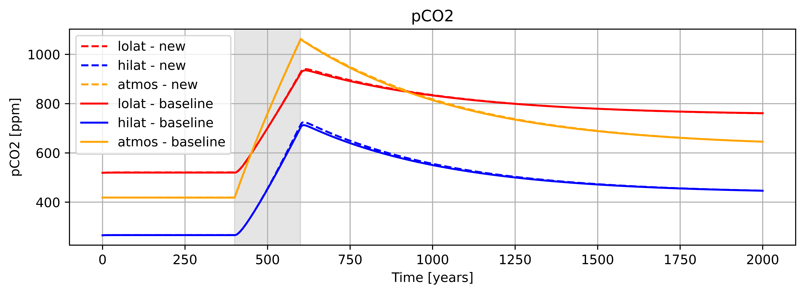
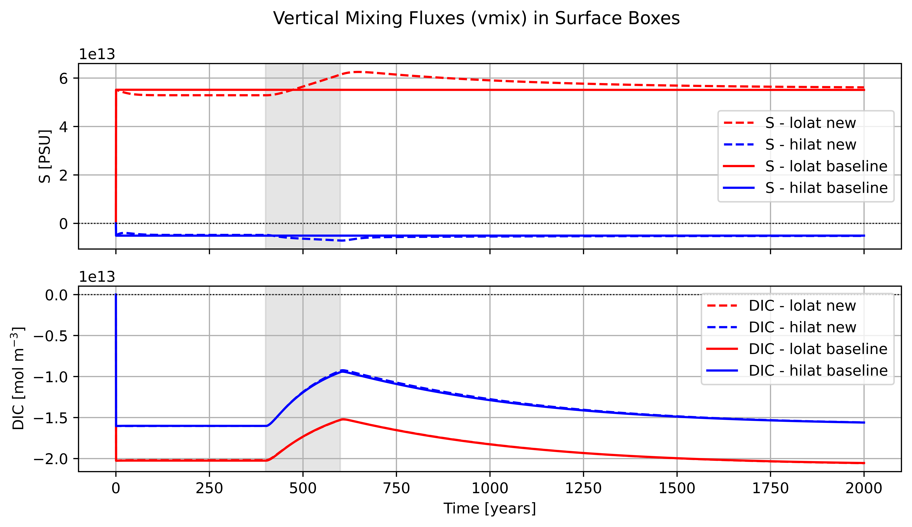
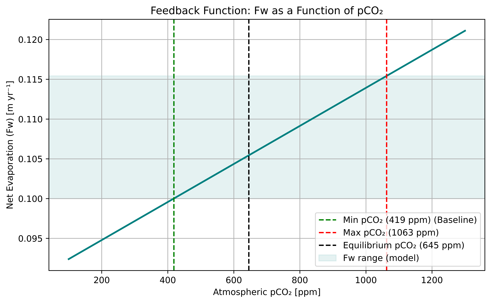

# Thermohaline Circulation Model

A 4-box ocean-atmosphere carbon cycle model, built and extended as part of the Quantitative Environmental Science course (Part IB Natural Sciences, Cambridge), studying how a climate feedback mechanism changes the ocean's response to a pulse of CO₂ emissions.

## Goal

The baseline model (from the course's [OceanTools](https://github.com/Quantitative-Environmental-Science/OceanTools) framework) represents the ocean as four coupled boxes — low-latitude surface, high-latitude surface, deep ocean, and atmosphere — each tracking temperature, salinity, and carbon chemistry (DIC, alkalinity, phosphate, pCO₂). Circulation between boxes is driven by a density-dependent overturning term, and the freshwater balance (evaporation − precipitation, `Fw`) is fixed at a constant value.

In reality, evaporation and precipitation patterns respond to the climate state itself. The question this project asks: **if freshwater forcing responds to atmospheric CO₂ rather than staying fixed, how does that change the ocean's recovery from a carbon emissions event?**

## Method

1. Run the baseline model forward 2000 years to a steady state, then inject a pulse of 8 GtC/yr of CO₂ emissions for 200 years (a modelled ~equivalent of a major anthropogenic emissions event).
2. Modify the model so the freshwater flux responds linearly to the atmospheric pCO₂ anomaly relative to a reference value: `Fw = 0.1 + β × ((pCO2 / pCO2_ref) − 1)`, introducing a feedback loop between the carbon cycle and ocean circulation.
3. Compare the modified model's trajectory against the fixed-`Fw` baseline across the emissions pulse and the subsequent recovery.

## Results

**Circulation strength and atmospheric pCO₂ diverge once emissions start**, since increasing atmospheric CO₂ now feeds back into the freshwater forcing rather than leaving circulation unaffected:

**The freshwater flux itself tracks the emissions pulse** — rising while CO₂ is being released, then relaxing back down once emissions stop, on a timescale set by how quickly atmospheric pCO₂ itself decays:

**The relaxation of the coupled system back toward steady state** after the emissions period ends, shown alongside the baseline for comparison:

**The assumed Fw–pCO₂ relationship itself**, showing where the model's actual pCO₂ range over the simulation falls relative to the full sensitivity curve:

Full derivation, discussion, and answers to the accompanying course questions are in `Q9_rainfall.ipynb`.
